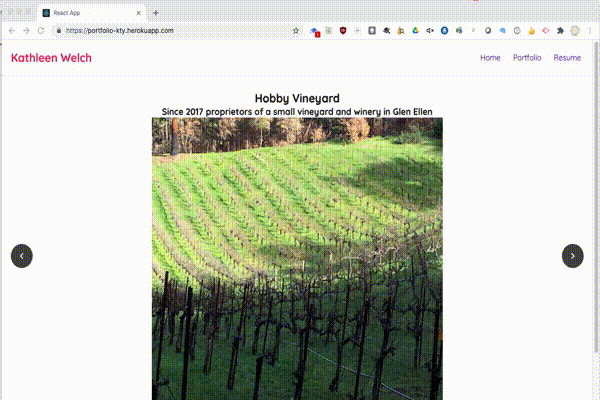

# Reactified Portfolio

This version of the portfolio uses the MERN fullstack the portfolio informatin is in a Mongo DB, the Backend is deveop using Express, the  Frontend is built on the React and all using Node.js.

The portfolio has a Home page that tells a little bit about who am I, the portfolios covers some of the projects completed during the  MERN bootcamp.

[The portfolio  application can be found on github repository ](https://github.com/ktywelch/Employee-Directory.git)

[The portfolio deployed application can be found on heroku](https://portfolio-kty.herokuapp.com/)

## Table of contents
* [Design](#Design)
* [Installation](#Installation)
* [Usage](#Usage)
* [Technologies](#Technologies)
* [Contributions](#Contributions)
* [License](#License)

## Design
The design utilizes the full MERN stack and includes the following modules:
 react, NPM and JavaScript to create a web site that will  allow the user to filter on employees by name. Sort the employess by clicking on the button at the top of the column. The sort direction, can be changed from ascending to descending as the button is clicked. To filter the list by first and last name enter can be completed by typing text in the search button. The search is responsive and will update as the user changes the content of the search box.

## Installation
The installation process is a download of git source, using npm install to install required modules based on the package.json file included in the same directory as the application.

The application uses a MongoDB instance running on the local server and assumes the user has installed the service and that the service is wotking.

## Usage
The application is a MERN stack,  to start the application run:

``` npm run dev```

The application does not have the ability to create project information so the data is in a seeds file, to populate run:

```node seeder\seeder.js```

Below is  gif image of the user interface.




## Technologies
* Mongo Db
* Express 
* React 
* Node.js

## Contributions - Study peers
* Sam Ayler
* Vincent Gines
* Albert Cheng
* Lucah Endicott

## License
ISC License (ISC)


Permission to use, copy, modify, and/or distribute this software for any purpose with or without fee is hereby granted, provided that the above copyright notice and this permission notice appear in all copies.

THE SOFTWARE IS PROVIDED "AS IS" AND THE AUTHOR DISCLAIMS ALL WARRANTIES WITH REGARD TO THIS SOFTWARE INCLUDING ALL IMPLIED WARRANTIES OF MERCHANTABILITY AND FITNESS. IN NO EVENT SHALL THE AUTHOR BE LIABLE FOR ANY SPECIAL, DIRECT, INDIRECT, OR CONSEQUENTIAL DAMAGES OR ANY DAMAGES WHATSOEVER RESULTING FROM LOSS OF USE, DATA OR PROFITS, WHETHER IN AN ACTION OF CONTRACT, NEGLIGENCE OR OTHER TORTIOUS ACTION, ARISING OUT OF OR IN CONNECTION WITH THE USE OR PERFORMANCE OF THIS SOFTWARE.
